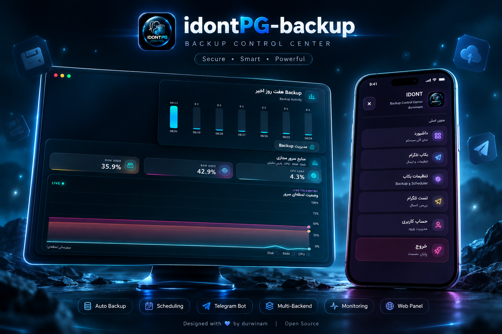

<div align="center">

**🇮🇷 فارسی | 🇬🇧 English | 🇷🇺 Русский**

[فارسی](#فارسی) · [English](#english) · [Русский](#русский)

</div>

---

<a id="فارسی"></a>

# 🛡️ idontPG-backup

<div align="center">

### Advanced Backup & Migration Suite for PasarGuard

برگرفته از pg_backup  
**Backup · Restore · Migration · Telegram · Multi-Database · Docker**

یک ابزار کامل برای مدیریت بکاپ، بازیابی و انتقال زیرساخت‌های  
**PasarGuard** و **PG-Node** بین سرورها.

<div align="center">
  
</div>

<br>

<div align="center">
  
</div>

</div>

---

<div align="center">

[](https://github.com/durwinam/idontPG-backup)
[](https://www.python.org/)
[](https://www.docker.com/)
[](https://github.com/durwinam/idontPG-backup)

</div>

---
🌐 Web Panel

🖥️ Professional Backup Management & Monitoring

idontPG-backup دارای یک پنل وب سبک و حرفه‌ای برای مدیریت و مانیتورینگ Backupها است.

این پنل با تمرکز روی سرعت، سادگی و نمایش اطلاعات مهم سیستم طراحی شده و بدون نیاز به Frameworkهای سنگین قابل اجرا است. ✨

🚀 پنل کاملاً Dependency-Free طراحی شده و برای اجرا نیازی به Flask، Node.js یا سایر Frameworkهای اضافی ندارد.

⚙️ پنل به‌صورت یک سرویس systemd روی سیستم نصب و مدیریت می‌شود و به‌طور پیش‌فرض روی پورت "5000" در دسترس خواهد بود. 🔐

امکانات پنل

- 🌐 مدیریت Backup از طریق مرورگر
- 📊 نمایش میزان مصرف CPU
- 🧠 نمایش میزان مصرف RAM
- 💾 نمایش میزان مصرف Disk
- 🕒 نمایش ۳ فعالیت اخیر
- 📤 ارسال Backup به‌صورت دستی
- 🤖 ارسال پیام تست به ربات Telegram
- 📦 مدیریت Backupهای ذخیره‌شده
- 🔎 نمایش وضعیت عملیات Backup
  
```bash
Web panel_URL:http://IP-SERVER:5000
```

🛠 نصب و اجرا
```bash
sudo bash -c "$(curl -sL https://raw.githubusercontent.com/durwinam/idontPG-backup/main/install.sh)"
```
پس از نصب:
```bash
idontPG-backup
```
برای آپدیت:
```bash
idont-backup update
```


✦ درباره پروژه

idontPG-backup یک Backup Suite مستقل و سبک برای محیط‌های
PasarGuard و PG-Node است که با هدف ساده‌کردن فرآیندهای Backup، Restore
و Migration طراحی شده است.

این پروژه تلاش می‌کند بدون وابستگی به پنل‌های جانبی یا فریم‌ورک‌های
سنگین، تمام مراحل موردنیاز برای انتقال اطلاعات را مدیریت کند.

از تشخیص نوع دیتابیس گرفته تا ساخت آرشیو، بررسی سلامت بکاپ،
ارسال به Telegram و بازیابی روی سرور مقصد.

مناسب برای

- 🖥️ سرورهای Production
- 🗄️ نصب‌های PasarGuard
- 🌐 سرورهای دارای PG-Node
- 🔄 انتقال سرویس به VPS جدید
- ☁️ نگهداری Backup خارج از سرور
- 🤖 Backup خودکار Telegram
- 🐳 محیط‌های Docker

# ⚡ قابلیت‌های اصلی

| قابلیت | توضیح |
|---|---|
| 🐳 Docker Environment | پشتیبانی و مدیریت در محیط Docker |
| 🤖 Automatic Telegram Backup | بکاپ خودکار و ارسال به Telegram |
| 🗄️ Backup Storage | نگهداری و مدیریت Backupها |
| 🖥️ Panel & Node Backup | بکاپ از PasarGuard Panel و PG-Node |
| 📦 Full Backup | تهیه نسخه کامل از اطلاعات |
| 🧩 Large File Splitting | تقسیم خودکار فایل‌های حجیم |
| ⏱️ Backup Scheduler | اجرای Backup در زمان‌ها و بازه‌های مختلف |
| 🔎 Auto Backend Detection | تشخیص خودکار Backend |
| 🔐 Sensitive Data Protection | محافظت از اطلاعات حساس |
| 🌐 Web Management | مدیریت Backup از طریق مرورگر |
| 💻 CLI Management | مدیریت Backup از طریق Terminal |
| 📊 System Resource Monitor | نمایش میزان مصرف CPU، RAM و Disk |
| 🕒 Recent Activities | نمایش ۳ فعالیت اخیر |
| 📤 Manual Backup | ارسال Backup به‌صورت دستی |
| 🤖 Telegram Bot Test | ارسال پیام تست به ربات Telegram |
| ♻️ Restore | 🚧 به‌زودی |
| 🚚 Migration | 🚧 به‌زودی |
| 🔄 Transfer | 🚧 به‌زودی |

# 🗄️ Database Engine Support

سیستم قبل از شروع عملیات، Backend نصب‌شده روی PasarGuard را به‌صورت خودکار شناسایی می‌کند.

| Database Engine | قابلیت‌ها |
|---|---|
| 🟢 **SQLite** | • Backup مستقیم فایل دیتابیس<br>• Restore با مسیر مقصد اعتبارسنجی‌شده<br>• محافظت در برابر overwrite مسیرهای غیرمجاز |
| 🔵 **PostgreSQL** | • `pg_dump`<br>• `pg_dumpall`<br>• Backup تمام Databaseها<br>• Backup اطلاعات Global<br>• Restore جداگانه هر Database |
| 🟣 **TimescaleDB** | • تمام قابلیت‌های PostgreSQL<br>• تشخیص TimescaleDB<br>• ثبت نسخه Extension<br>• Restore مستقل Databaseها |
| 🟠 **MySQL / MariaDB** | • `mysqldump`<br>• Backup مستقل Databaseها<br>• ایجاد خودکار Database در Restore<br>• تشخیص Credential مناسب<br>• Fallback خودکار در شرایط خطای Authentication |


```bash
🧠 تشخیص خودکار Backend

نیازی نیست نوع دیتابیس را دستی وارد کنید.

فرآیند تشخیص به شکل زیر انجام می‌شود:

PasarGuard
    │
    ├── /opt/pasarguard/.env
    │
    └── docker-compose.yml
            │
            ▼
    SQLAlchemy Database URL
            │
            ▼
    Backend Detection
            │
            ├── SQLite
            ├── PostgreSQL
            ├── TimescaleDB
            └── MySQL / MariaDB
            │
            ▼
    Docker Service Validation
            │
            ▼
    Backup Engine

---

🚧 Coming Soon

قابلیت‌های پیشرفته زیر در نسخه‌های آینده اضافه خواهند شد:

- ♻️ Restore
- 🚚 Migration
- 🔄 Transfer

```

📡 Telegram

برای ارتباط و پشتیبانی:

Telegram: http://t.me/DuRnaziiAy

GitHub: https://github.com/durwinam
## 📚 مستندات

برای مشاهده راهنمای کامل نصب، استفاده، تنظیمات و قابلیت‌های **idontPG-backup**:

**🌐 [مستندات idontPG-backup](https://docs.mypanelhome.ir)**

نسخه آنلاین و کامل مستندات:
https://docs.mypanelhome.ir
---

<div align="center">🛡️ idontPG-backup

Lightweight · Fast · Secure · Reliable

</div>

---

<a id="english"></a>

# 🛡️ idontPG-backup

<div align="center">

### Advanced Backup & Migration Suite for PasarGuard

Based on pg_backup  
**Backup · Restore · Migration · Telegram · Multi-Database · Docker**

A complete tool for managing backups, restoring data, and migrating  
**PasarGuard** and **PG-Node** infrastructure between servers.

<div align="center">
  
</div>

<br>

<div align="center">
  
</div>

</div>

---

<div align="center">

[](https://github.com/durwinam/idontPG-backup)
[](https://www.python.org/)
[](https://www.docker.com/)
[](https://github.com/durwinam/idontPG-backup)

</div>

---

# 🌐 Web Panel

## 🖥️ Professional Backup Management & Monitoring

idontPG-backup includes a lightweight and professional web panel for managing and monitoring backups.

The panel is designed with a focus on **speed, simplicity, and important system information**, without relying on heavy frameworks. ✨

🚀 The panel is completely **Dependency-Free** and does not require Flask, Node.js, or any other additional frameworks.

⚙️ The panel is installed and managed as a **systemd** service and is available by default on port `5000`. 🔐

### Panel Features

- 🌐 Manage backups through the browser
- 📊 Display CPU usage
- 🧠 Display RAM usage
- 💾 Display Disk usage
- 🕒 Display the 3 most recent activities
- 📤 Send backups manually
- 🤖 Send test messages to the Telegram bot
- 📦 Manage stored backups
- 🔎 Display backup operation status

```bash
Web panel_URL:http://IP-SERVER:5000
```

---

# 🛠 Installation & Usage

```bash
sudo bash -c "$(curl -sL https://raw.githubusercontent.com/durwinam/idontPG-backup/main/install.sh)"
```

After installation:

```bash
idontPG-backup
```

To update:

```bash
idont-backup update
```

---

# ✦ About the Project

**idontPG-backup** is an independent and lightweight Backup Suite for
PasarGuard and PG-Node environments, designed to simplify Backup, Restore,
and Migration processes.

The project aims to handle all required data transfer operations without relying on third-party panels or heavy frameworks.

From detecting the database type and creating archives to verifying backup integrity,
sending backups to Telegram, and restoring them on the destination server.

### Suitable For

- 🖥️ Production servers
- 🗄️ PasarGuard installations
- 🌐 Servers running PG-Node
- 🔄 Migrating services to a new VPS
- ☁️ Storing backups outside the server
- 🤖 Automatic Telegram backups
- 🐳 Docker environments

---

# ⚡ Main Features

| Feature | Description |
|---|---|
| 🐳 Docker Environment | Docker environment support and management |
| 🤖 Automatic Telegram Backup | Automatic backup creation and Telegram delivery |
| 🗄️ Backup Storage | Backup storage and management |
| 🖥️ Panel & Node Backup | Backup of PasarGuard Panel and PG-Node |
| 📦 Full Backup | Create a complete backup |
| 🧩 Large File Splitting | Automatically split large files |
| ⏱️ Backup Scheduler | Run backups at different times and intervals |
| 🔎 Auto Backend Detection | Automatically detect the database backend |
| 🔐 Sensitive Data Protection | Protect sensitive information |
| 🌐 Web Management | Manage backups through the browser |
| 💻 CLI Management | Full backup management through the Terminal |
| 📊 System Resource Monitor | Display CPU, RAM, and Disk usage |
| 🕒 Recent Activities | Display the 3 most recent activities |
| 📤 Manual Backup | Manually send backups |
| 🤖 Telegram Bot Test | Send a test message to the Telegram bot |
| ♻️ Restore | 🚧 Coming Soon |
| 🚚 Migration | 🚧 Coming Soon |
| 🔄 Transfer | 🚧 Coming Soon |

---

# 🗄️ Database Engine Support

Before starting an operation, the system automatically detects the installed Backend on PasarGuard.

| Database Engine | Capabilities |
|---|---|
| 🟢 **SQLite** | • Direct database file Backup<br>• Restore with a validated destination path<br>• Protection against unauthorized path overwrites |
| 🔵 **PostgreSQL** | • `pg_dump`<br>• `pg_dumpall`<br>• Backup all Databases<br>• Backup Global data<br>• Separate Restore for each Database |
| 🟣 **TimescaleDB** | • All PostgreSQL capabilities<br>• TimescaleDB detection<br>• Extension version detection<br>• Independent Database Restore |
| 🟠 **MySQL / MariaDB** | • `mysqldump`<br>• Independent Database Backup<br>• Automatic Database creation during Restore<br>• Automatic Credential detection<br>• Automatic fallback on Authentication errors |

---

```bash
🧠 Automatic Backend Detection

You do not need to manually specify the database type.

The detection process works as follows:

PasarGuard
    │
    ├── /opt/pasarguard/.env
    │
    └── docker-compose.yml
            │
            ▼
    SQLAlchemy Database URL
            │
            ▼
    Backend Detection
            │
            ├── SQLite
            ├── PostgreSQL
            ├── TimescaleDB
            └── MySQL / MariaDB
            │
            ▼
    Docker Service Validation
            │
            ▼
    Backup Engine

---

🚧 Coming Soon

The following advanced features will be added in future versions:

- ♻️ Restore
- 🚚 Migration
- 🔄 Transfer

```

---

# 📡 Telegram

For contact and support:

**Telegram:** http://t.me/DuRnaziiAy

**GitHub:** https://github.com/durwinam
## 📚 Documentation

For the complete installation guide, usage instructions, configuration, and features of **idontPG-backup**:

**🌐 [idontPG-backup Documentation](https://docs.mypanelhome.ir)**

Online documentation:
https://docs.mypanelhome.ir
---

<div align="center">

🛡️ **idontPG-backup**

**Lightweight · Fast · Secure · Reliable**

</div>

---

<a id="русский"></a>

# 🛡️ idontPG-backup

<div align="center">

### Продвинутый комплекс резервного копирования и миграции для PasarGuard

Основан на pg_backup  
**Backup · Restore · Migration · Telegram · Multi-Database · Docker**

Полноценный инструмент для управления резервным копированием, восстановлением и переносом инфраструктуры  
**PasarGuard** и **PG-Node** между серверами.

<div align="center">
  
</div>

<br>

<div align="center">
  
</div>

</div>

---

<div align="center">

[](https://github.com/durwinam/idontPG-backup)
[](https://www.python.org/)
[](https://www.docker.com/)
[](https://github.com/durwinam/idontPG-backup)

</div>

---

🌐 Веб-панель

🖥️ Профессиональное управление и мониторинг резервных копий

idontPG-backup включает лёгкую и профессиональную веб-панель для управления и мониторинга резервных копий.

Панель разработана с акцентом на скорость, простоту и отображение важной информации о системе и не требует тяжёлых Framework. ✨

🚀 Панель полностью **Dependency-Free** и для работы не требует Flask, Node.js или других дополнительных Framework.

⚙️ Панель устанавливается и управляется как сервис **systemd** и по умолчанию доступна на порту "5000". 🔐

Возможности панели

- 🌐 Управление Backup через браузер
- 📊 Отображение загрузки CPU
- 🧠 Отображение использования RAM
- 💾 Отображение использования Disk
- 🕒 Отображение 3 последних действий
- 📤 Ручная отправка Backup
- 🤖 Отправка тестового сообщения Telegram-боту
- 📦 Управление сохранёнными Backup
- 🔎 Отображение состояния операции Backup
  
```bash
Web panel_URL:http://IP-SERVER:5000
```

🛠 Установка и запуск

```bash
sudo bash -c "$(curl -sL https://raw.githubusercontent.com/durwinam/idontPG-backup/main/install.sh)"
```

После установки:

```bash
idontPG-backup
```

Для обновления:

```bash
idont-backup update
```

---

✦ О проекте

idontPG-backup — это независимый и лёгкий Backup Suite для окружений
PasarGuard и PG-Node, созданный для упрощения процессов Backup, Restore
и Migration.

Проект стремится управлять всеми необходимыми этапами переноса данных без зависимости от сторонних панелей или тяжёлых Framework.

От определения типа базы данных до создания архива, проверки целостности Backup,
отправки в Telegram и восстановления на целевом сервере.

Подходит для

- 🖥️ Production-серверов
- 🗄️ Установок PasarGuard
- 🌐 Серверов с PG-Node
- 🔄 Переноса сервиса на новый VPS
- ☁️ Хранения Backup вне сервера
- 🤖 Автоматического Backup в Telegram
- 🐳 Docker-окружений

# ⚡ Основные возможности

| Возможность | Описание |
|---|---|
| 🐳 Docker Environment | Поддержка и управление в Docker-окружении |
| 🤖 Automatic Telegram Backup | Автоматическое создание и отправка Backup в Telegram |
| 🗄️ Backup Storage | Хранение и управление Backup |
| 🖥️ Panel & Node Backup | Backup панели PasarGuard и PG-Node |
| 📦 Full Backup | Создание полного Backup |
| 🧩 Large File Splitting | Автоматическое разделение больших файлов |
| ⏱️ Backup Scheduler | Запуск Backup в различное время и по заданным интервалам |
| 🔎 Auto Backend Detection | Автоматическое определение Backend |
| 🔐 Sensitive Data Protection | Защита конфиденциальной информации |
| 🌐 Web Management | Управление Backup через браузер |
| 💻 CLI Management | Полное управление Backup через Terminal |
| 📊 System Resource Monitor | Отображение использования CPU, RAM и Disk |
| 🕒 Recent Activities | Отображение 3 последних действий |
| 📤 Manual Backup | Ручная отправка Backup |
| 🤖 Telegram Bot Test | Отправка тестового сообщения Telegram-боту |
| ♻️ Restore | 🚧 Скоро |
| 🚚 Migration | 🚧 Скоро |
| 🔄 Transfer | 🚧 Скоро |

# 🗄️ Поддержка движков баз данных

Перед началом операции система автоматически определяет установленный Backend на PasarGuard.

| Database Engine | Возможности |
|---|---|
| 🟢 **SQLite** | • Прямой Backup файла базы данных<br>• Restore с проверенным целевым путём<br>• Защита от несанкционированной перезаписи путей |
| 🔵 **PostgreSQL** | • `pg_dump`<br>• `pg_dumpall`<br>• Backup всех Database<br>• Backup Global-данных<br>• Отдельный Restore каждой Database |
| 🟣 **TimescaleDB** | • Все возможности PostgreSQL<br>• Определение TimescaleDB<br>• Определение версии Extension<br>• Независимый Restore Database |
| 🟠 **MySQL / MariaDB** | • `mysqldump`<br>• Независимый Backup Database<br>• Автоматическое создание Database при Restore<br>• Определение подходящих Credential<br>• Автоматический Fallback при ошибке Authentication |


```bash
🧠 Автоматическое определение Backend

Вам не нужно вручную указывать тип базы данных.

Процесс определения выполняется следующим образом:

PasarGuard
    │
    ├── /opt/pasarguard/.env
    │
    └── docker-compose.yml
            │
            ▼
    SQLAlchemy Database URL
            │
            ▼
    Backend Detection
            │
            ├── SQLite
            ├── PostgreSQL
            ├── TimescaleDB
            └── MySQL / MariaDB
            │
            ▼
    Docker Service Validation
            │
            ▼
    Backup Engine

---

🚧 Скоро

Следующие расширенные возможности будут добавлены в будущих версиях:

- ♻️ Restore
- 🚚 Migration
- 🔄 Transfer

```

📡 Telegram

Для связи и поддержки:

Telegram: http://t.me/DuRnaziiAy

GitHub: https://github.com/durwinam
## 📚 Документация

Полное руководство по установке, использованию, настройке и возможностям **idontPG-backup**:

**🌐 [Документация idontPG-backup](https://docs.mypanelhome.ir)**

Онлайн-документация:
https://docs.mypanelhome.ir
---

<div align="center">

🛡️ idontPG-backup

Лёгкий · Быстрый · Безопасный · Надёжный

</div>
